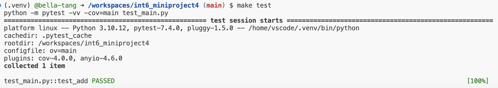
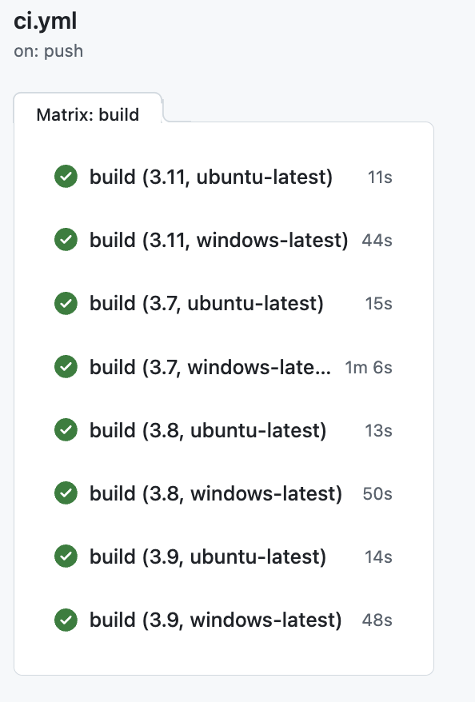

# int6_miniproject4

This repo contains work for mini-project 4. It sets up an environment on codespaces and uses Github Actions to run a Makefile for the following: `make install`, `make test`, `make format`, `make lint`. 

Some important components:

* `Makefile`

* `Dockerfile`

* A base set of libraries for devops and web

* `githubactions` 

## Purpose of project
The purpose of this project is to use a Github actions matrix to test python code across multiple python versions and operating systems. This ensures that the workflow is compatible across different environments. The file main.py contains a simple "add" function that is tested in test_main.py. To make sure github actions is working properly, I use a Makefile to test various parts of my code.

## Configurations Tested
* Python 3.7, 3.8, 3.9, 3.11
* OS: ubuntu-latest, windows-latest

## Preparation
1. Open codespaces 
2. Wait for container to be built and virtual environment to be activated with requirements.txt installed 

## Check format and test errors 
1. Format code `make format`
2. Lint code `make lint`
3. Test code `make test`

## Matrix Build

